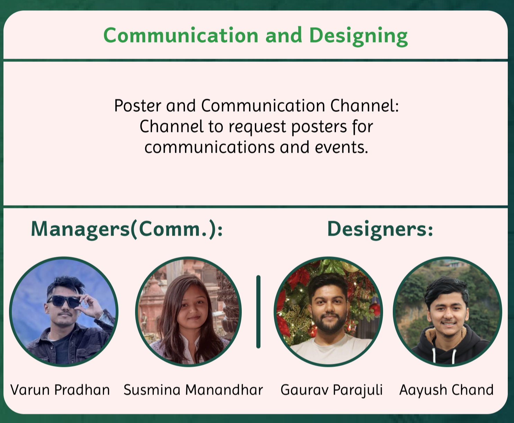

## Communication and Design Working Group

## About

The Communication and Designing working group keeps the community informed and connected by flowing the information about the community. They handle everything from creating clear messages to posting eye-catching posters for different events. They use a variety of channels, including social medias, to get the word out effectively of the events, meetings, and so on.

## Managers

### Communication Managers

- Varun Pradhan
- Susmina Manandhar

### Designing Managers

- Gaurav Parajuli
- Aayush Chand

## Goals

- Information flow
- Foster a strong and engaged community

## Objectives

- Improve engagement in the community
