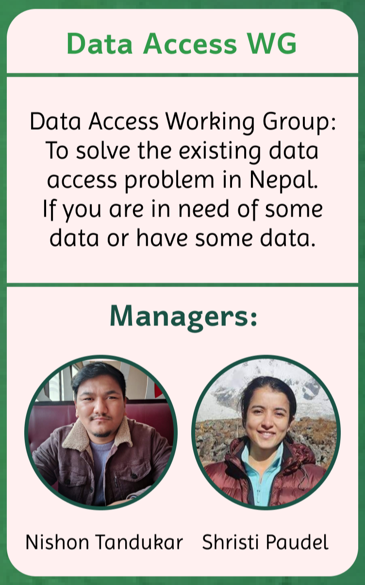

## Data Access Working Group

## About

Data access working group is responsible for maintaining information related to the data accessibility. As there are dispersed information of different data in Nepal also the available information are not in standard format, we plan to solve this problem by creating a data bank with proper formatting, standard and licensing.

## Managers

- Nishon Tandukar
- Shristi Paudel

## Goals

- Create data bank
- Solve data access problem in Nepal.

## Objectives

- Collect and store information related to data accessibility in a single place.
