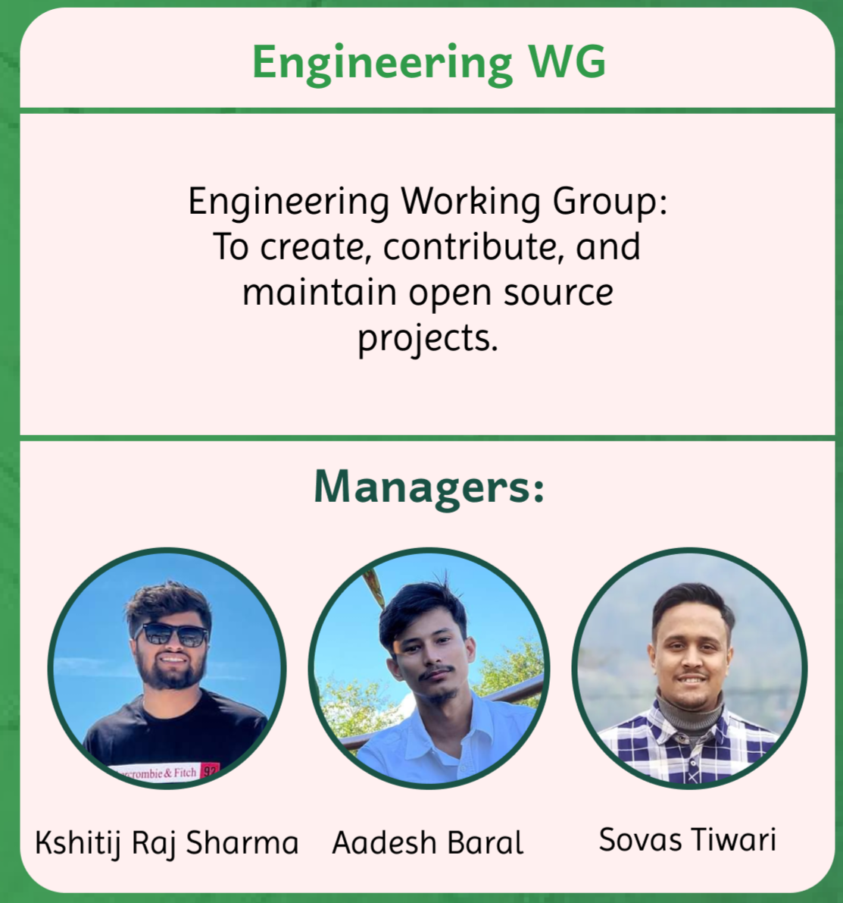

## Engineering Working Group

## About

Engineering Working Group is responsible for bringing together technical minds to tackle challenges and direct community towards identifying and developing solutions. We focus on developing innovative solutions, fostering collaboration among tech enthusiasts, and establishing best practices. By working together, we push the boundaries and drives the community forward.

## Managers

- Kshitij Raj Sharma
- Aadesh Baral
- Sovas Tiwari

## Goals

- To create, contribute, and maintain open source projects.
- Establishing Best Practices and standard licensing

## Objectives

- Collaborate with external organizations
- Host coding party to share knowledge and explore new technologies
