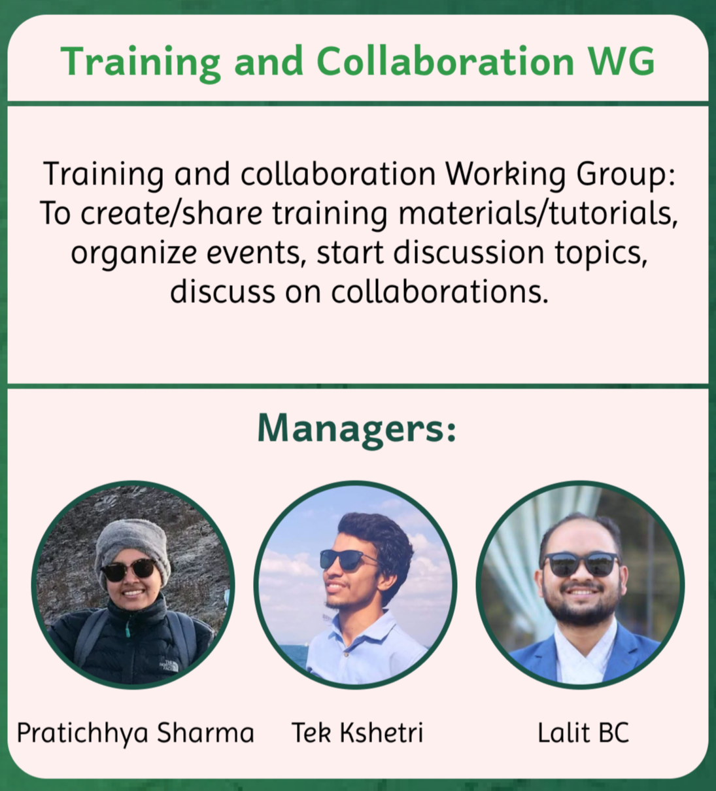

## Training and Collaboration WG

## About

raining and Collaboration Working Group is responsible for developing knowledge, fostering collaboration, and empowering members of the community. We act as a platforms and opportunities for members to connect, share knowledge, and work together on projects.

## Managers

- Pratichhya Sharma
- Tek Kshetri
- Lalit BC

## Goals

- Organize training and collaboration events.

## Objectives

- Create/share training materials/tutorials
- Organize events, collaborations and start discussion topics.
